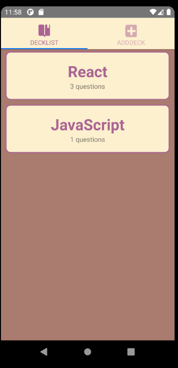
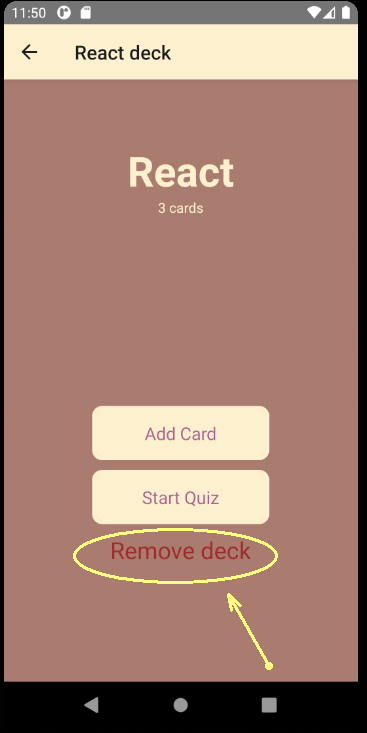
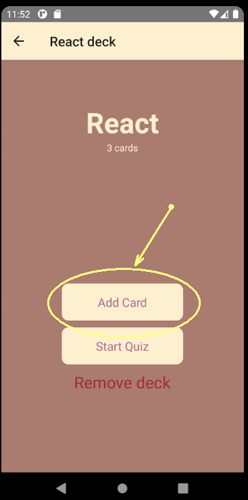
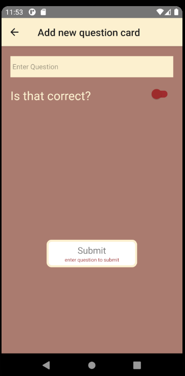
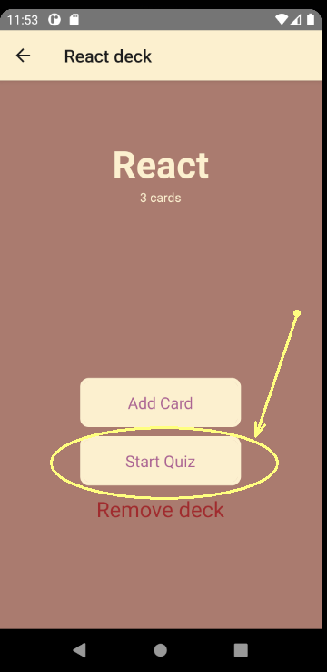
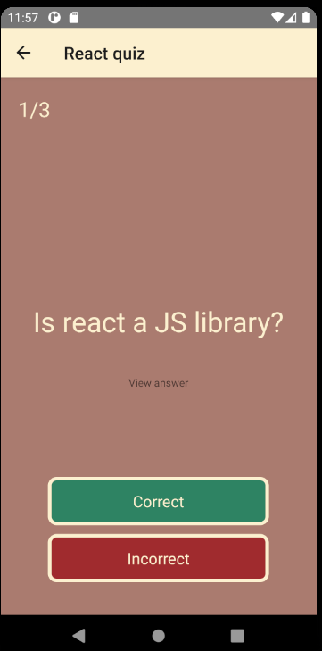
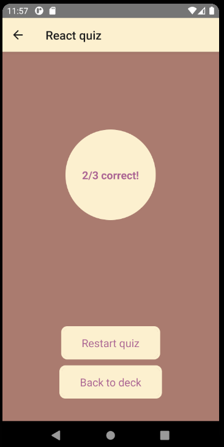

# Mobile Flashcards Project

## Description
This is an **Android** app for creating flashcards to train your memory

## Usage 

### 0. Select the starting deck.

There are two initial decks provided: React and Javascript:

### 1. Adding new deck.
Open the ADDDECK tab and enter the deck name, then hit "Add deck!" button:

### 2. Actions with a deck:
#### 2.1 Remove the deck:
To remove the deck, press "Remove deck" on the Deck screen:

#### 2.2 Add new question card:
To add new question card, hit "Add card" button:

The question creation view will appear. Enter the question and toggle the answer tubmler to form a new question. Then, hit Submit

#### 2.3 Take a quiz:

To start a quiz, hit "Start Quiz button":

Then, answer the questions by clicking Correct or Incorrect:

When you answer all the questions, you will see your results:

From this screen, you can return back to the deck or restart the quiz.

## Running the app

To run the project:

* install all project dependencies with `yarn install`
* start the development server with `yarn android`
